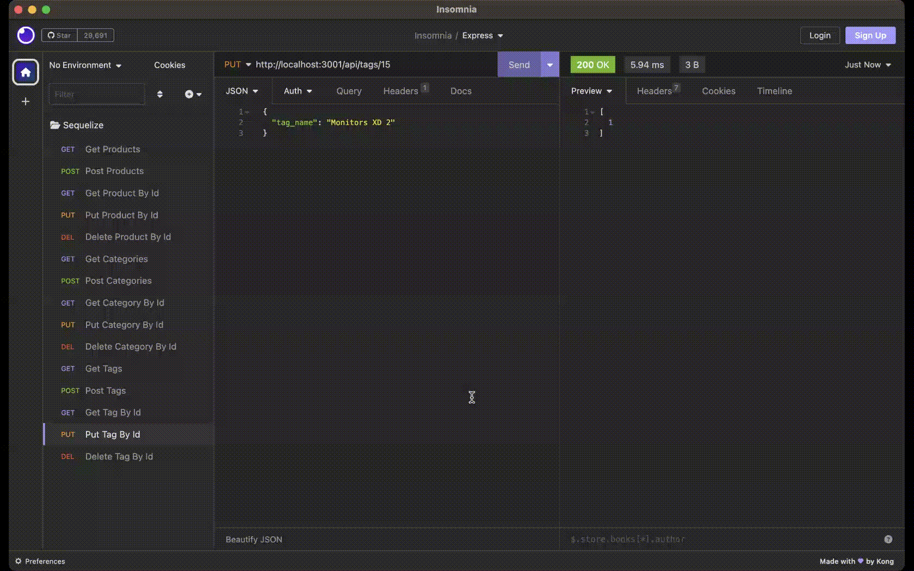

# 13-ORM-E-CommercePlatform

[](http://choosealicense.com/licenses/mit/)

## Description
A back end application for my e-commerce website built using sequelize, mysql, dottenv and express. Express serves API routes to perform RESTful CRUD operations.

## Table of Contents
 - [Installation](#installation)
 - [Usage](#usage)
 - [Credits](#credits)
 - [License](#license)
 - [Contributor](#contributor)

## Installation
Clone the github repo as shown below, <br/><br/> ``` git clone git@github.com:chandraucb/13-ORM-E-CommercePlatform.git ``` <br/><br/> Run node package install <br/><br/> ``` npm install ``` <br/><br/> Execute schema.sql to generate schema within mysql database <br/><br/> Update .env with database configuration. <br/><br/> Execute command to generated seed data <br/><br/> ```node seeds/index.js ```

## Usage
To start this application execute below command and follow the prompts <br/><br/> ```npm start ``` <br/> <br/>  

## Credits

https://github.com/sidorares/node-mysql2
https://github.com/sequelize/sequelize
https://github.com/motdotla/dotenv

## License
Copyright (c) 2023 Chandrasekar Mohan
Licensed under the MIT License


## Contributor
Code contributions are welcome! <br> To contributre, make a fork and clone of the project to your local repo to include your changes. <br> Once changes are ready, create a pull request to merge them to main branch. <br> Include CONTRIBUTOR.md to get the credits


## Questions 
  Name : Chandrasekar Mohan 
  Git profile : https://github.com/chandraucb 
  Contact email : xyz@abc.com 
  Reach me through email with additional questions

